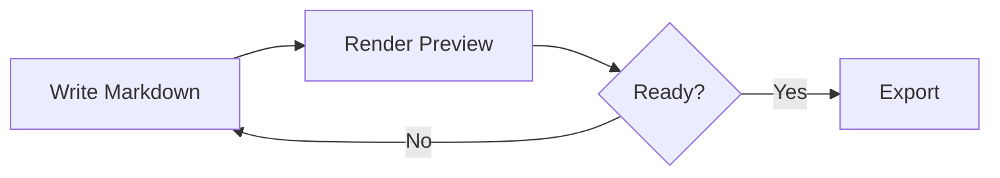

# Local Docs Studio Feature Guide

Use this guide as a quick tour of the local Markdown, Mermaid, export, and docs-site features. It opens in read-only mode from the Help menu, so it is safe to browse while keeping your own files untouched.

## Open And Edit

- Open a single `.md`, `.markdown`, `.mmd`, or `.mermaid` file.
- Open a folder to browse multiple documents from the sidebar.
- Import a Markdown Bundle or generic ZIP from the File menu.
- Import a DOCX or HTML document from the File menu to convert it into editable Markdown.
- Save edits back to supported local files, or download a Markdown copy when the browser cannot write directly.

## Markdown Editor

The editor keeps the app lightweight while still covering daily documentation work.

| Feature | Shortcut or action |
|---|---|
| Save | Ctrl/Cmd+S |
| Render | Ctrl/Cmd+Enter |
| Undo and redo | Ctrl/Cmd+Z and Ctrl/Cmd+Y |
| Mermaid snippets | Ctrl/Cmd+Space in Mermaid context |
| Layout modes | View menu: Editor, Split, Preview |
| Follow editor selection | Preview header checkbox |

Formatting buttons insert Markdown for headings, emphasis, links, lists, task lists, quotes, code blocks, images, horizontal rules, Mermaid blocks, and tables.

Right-click in the editor or rendered preview to open context actions for the current selection, code block, table, or diagram.

Rendered tables include a Copy button that places tab-separated text on the clipboard so it can be pasted directly into Excel or another spreadsheet.

Formatted content copied from rich editors pastes back into the editor as Markdown when the clipboard includes HTML. Tables copied from Excel or another spreadsheet paste as Markdown tables when the clipboard includes HTML table data or tab-separated text. Use **Edit > Paste Special** to force paste as a table, plain text, fenced code block, quote, Markdown-converted HTML, list, checklist, numbered list, or Mermaid block.

```markdown
## Example Section

Use **bold**, *italic*, links, tables, and fenced code blocks.
```

## Preview And Review

The preview renders Markdown and Mermaid together. Use the preview header for:

- Outline navigation from headings.
- Find in preview.
- Document review metrics and non-blocking quality notes.
- Workspace link/asset audit notes and a View menu docs map for loaded files.
- Preview maximisation and diagram zoom controls.
- Follow short editor selections into the preview while using Split layout.

## Mermaid Diagrams

Mermaid blocks render as diagrams with per-diagram actions for Copy, SVG, and PNG. Fenced `mermaid` blocks and Azure DevOps `::: mermaid` wiki blocks both render. Broken diagrams show a friendly error with copy and jump-to-source actions.



## Exports

- **HTML** creates a standalone rendered document.
- **Word** creates a `.docx` with rendered diagrams and compatible content.
- **PDF** opens the browser print flow so you can choose Save as PDF.
- **Docs Site** builds a static GitHub Pages-friendly ZIP with theme, navigation, and search.
- Docs Site exports can read optional Markdown front matter for page title, description, order, tags, draft status, and navigation group.
- **Markdown Bundle** creates a round-trip ZIP with editable source files and managed images. Use **Azure DevOps Mermaid syntax** in the Export menu when the bundle should write Mermaid as `::: mermaid` blocks.
- **Import document** converts `.docx`, `.html`, and `.htm` files into editable Markdown. Embedded PNG, JPEG, GIF, and WebP images become managed session assets; PDF import is planned as a future text-only converter.
- **SVG/PNG** exports the current Mermaid diagram.
- **Copy HTML** and **Copy text** support quick sharing without downloads.

## Create And Studio Tools

Use Create for local templates:

- README and project docs.
- Release notes and changelogs.
- Requirements, PRDs, user stories, and Gherkin scenarios.

Use Studio for Mermaid-focused templates and snippets.

## Images

Drag images onto the editor to insert Markdown links like:

```markdown

```

The Markdown file stores the link. Exports include the image data or image files depending on the export type. PNG, JPEG, GIF, and WebP image files are supported; user-supplied SVG images are skipped for security.

Use **View > Manage assets** to preview session images, rename paths across editable Markdown files, and remove unused assets.

## Privacy

The app runs in the browser. Files stay local unless you save, export, copy, or import a new bundle. There is no backend or account system.
