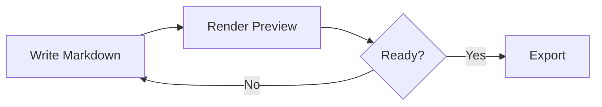

# Lens Docs Studio Feature Guide

Use this guide as a quick tour of the local Markdown, Mermaid, export, and docs-site features. It opens in read-only mode from the Help menu, so it is safe to browse while keeping your own files untouched.

## Open And Edit

- Open a single `.md`, `.markdown`, `.mmd`, or `.mermaid` file.
- Open a folder to browse a workspace from the sidebar.
- Switch the sidebar between flat list and folder tree views when folder hierarchy matters.
- Add files to the current workspace or create a new Markdown file inside a writable workspace folder.
- Import a Markdown Bundle or generic ZIP from the File menu.
- Import a DOCX, HTML, or PDF document from the File menu to convert it into editable Markdown.
- Save edits back to supported local files, use Save as for a new destination, or refresh the active file when it changes outside the app.

## Markdown Editor

The editor keeps the app lightweight while still covering daily documentation work.

| Feature | Shortcut or action |
|---|---|
| Save | Ctrl/Cmd+S |
| Render | Ctrl/Cmd+Enter |
| Undo and redo | Ctrl/Cmd+Z and Ctrl/Cmd+Y |
| Mermaid snippets | Ctrl/Cmd+Space in Mermaid context |
| Layout modes | Topbar icons: Editor, Split, Preview |
| Follow editor selection | Preview header checkbox |
| Manual snapshots | File menu: Create snapshot / Manage snapshots |

Formatting buttons insert Markdown for headings, emphasis, links, lists, task lists, quotes, code blocks, images, horizontal rules, Mermaid blocks, tables, semantic progress bars with preset colours, emoji, callouts, status badges, details blocks, image figures, keyboard shortcuts, and anchors.

Right-click in the editor or rendered preview to open context actions for the current selection, code block, table, or diagram.

Rendered tables include a Copy button that places tab-separated text on the clipboard so it can be pasted directly into Excel or another spreadsheet.

Formatted content copied from rich editors pastes back into the editor as Markdown when the clipboard includes HTML. Tables copied from Excel or another spreadsheet paste as Markdown tables when the clipboard includes HTML table data or tab-separated text. Use **Edit > Paste Special** to force paste as a table, plain text, fenced code block, quote, Markdown-converted HTML, list, checklist, numbered list, or Mermaid block.

```markdown
## Example Section

Use **bold**, *italic*, links, tables, and fenced code blocks.
```

## Preview And Review

The preview renders Markdown and Mermaid together. Use the preview header for:

- Outline navigation from headings.
- Find in preview.
- Document review metrics and non-blocking quality notes.
- Markdown governance checks for heading hierarchy, internal links, alt text, tables, British English terms, and TODO/FIXME markers.
- Workspace link/asset audit notes and a View menu docs map for loaded files.
- Preview maximisation, diagram theme selection, and diagram zoom controls.
- Follow short editor selections into the preview while using Split layout.

## Mermaid Diagrams

Mermaid blocks render as diagrams with per-diagram actions for Copy, SVG, and PNG. Fenced `mermaid` blocks and Azure DevOps `::: mermaid` wiki blocks both render. Broken diagrams show a friendly error with copy and jump-to-source actions.

Use the preview header's diagram theme selector for Auto, Lens, Default, Neutral, Forest, or Dark. Auto follows the app light/dark theme; explicit choices keep diagrams fixed. Diagram exports use the currently rendered Mermaid theme.



## Exports

- **HTML** creates a standalone rendered document.
- **Word** creates a `.docx` with rendered diagrams and compatible content. Use **Import Word template** and the **Word template** selector to apply a browser-local `.docx` template pack during export.
- **PDF** opens the browser print flow so you can choose Save as PDF.
- **Docs Site** builds a static ZIP with theme, navigation, and search that can open directly from `index.html` or be hosted on GitHub Pages.
- Docs Site exports can read optional Markdown front matter for page title, description, order, tags, draft status, and navigation group. With a loaded artefact bundle, safe metadata can fill missing title, order, evidence, and navigation hints; front matter remains highest priority.
- **Markdown Bundle** creates a round-trip ZIP with editable source files and managed images. Use **Azure DevOps Mermaid syntax** in the Export menu when the bundle should write Mermaid as `::: mermaid` blocks.
- **Export artefact review pack** is available only after importing a valid artefact bundle. It exports editable Markdown and managed images with a rebuilt safe `lens-artifact-bundle.json`; ordinary Markdown Bundle export does not include artefact metadata.
- Built-in export profiles are session-only. The Azure DevOps Wiki Markdown profile uses a session override and does not persist the DevOps Mermaid preference unless you use the existing toggle or saved local profile flow.
- Word export templates are imported from user-provided `.docx` files and stored locally in this browser profile. The MVP preserves supported styles, numbering, theme, default header/footer parts, header/footer relationships, and referenced media, then maps generated headings, body text, tables, code, quotes, and captions to the detected semantic styles where practical.
- Local development smoke ZIPs generated by `scripts/windows/New-LocalDevSmokeZip.ps1` can be served from a static server to manually validate Word template export without creating an official release. Corporate templates may be used only with permission and must stay out of source, generated ZIPs, and release assets.
- ZIPs may optionally include `lens-artifact-bundle.json` metadata. When present, the app still imports the Markdown and Mermaid files normally, opens a safe declared entry document, and shows a collapsible artefact reader panel with safe navigation, evidence chips, warnings, and local filters.
- Artefact bundle round-trip checks use source fixtures for valid, rich, invalid, unsafe, front matter, and generic ZIP cases so ordinary documentation import stays certified alongside the optional reader flow.
- **Import document** converts `.docx`, `.html`, `.htm`, and `.pdf` files into editable Markdown. Embedded PNG, JPEG, GIF, and WebP images become managed session assets where available. PDF import is text-only and creates page sections without OCR, image extraction, or visual layout reconstruction.
- **SVG/PNG** exports the current Mermaid diagram.
- **Copy HTML** and **Copy text** support quick sharing without downloads.
- **Copy Markdown with images** is available from the Edit menu and Editor context menu. It copies Markdown while replacing complete Mermaid blocks with inline PNG image references for destinations that do not render Mermaid source.

## Create And Studio Tools

Use Create for local templates:

- README and project docs.
- Release notes and changelogs.
- Requirements, PRDs, user stories, and Gherkin scenarios.

Use Studio for Mermaid-focused templates and snippets.

The Create menu can also save your current document as a local template, save selected Markdown as a local snippet, and import or export that local library as JSON. Saved export profiles in the Export menu remember browser-local export defaults through the existing local library key.

## Images

Drag images onto the editor to insert Markdown links like:

```markdown

```

The Markdown file stores the link. Exports include the image data or image files depending on the export type. PNG, JPEG, GIF, and WebP image files are supported; user-supplied SVG images are skipped for security.

Use **View > Manage assets** to preview session images, rename paths across editable Markdown files, and remove unused assets.

## Privacy

The app runs in the browser. Files stay local unless you save, export, copy, or import a new bundle. There is no backend or account system.

Use **Help > Windows shell diagnostics > Create support bundle** when you need a local troubleshooting summary for bridge, Open folder, or watcher issues. The app shows an inspectable JSON preview before copy or export. The bundle is local, you choose whether to share it, and no automatic upload occurs. It includes safe operational metadata only, such as app version/build, runtime category, bridge capability state, Open folder route/attempt state, selected workspace presence, count buckets, and watcher event category/timestamp. It does not include document contents, imported ZIP contents, full private paths, secrets, tokens, connection strings, emails, raw stack traces, screenshots, browser storage, or WebView2 user data.

Optional artefact bundle metadata is session-only and untrusted unless you explicitly export an artefact review pack. Evidence labels are displayed as supplied by the ZIP; candidate findings remain candidate findings. Reader filters stay inside the reader panel and are not stored.

Future compatible producers should follow `docs/integration/lens-artifact-bundle-producer-guide.md`. Release candidates should follow `docs/release/lens-docs-studio-artefact-bundle-manual-smoke.md`.
