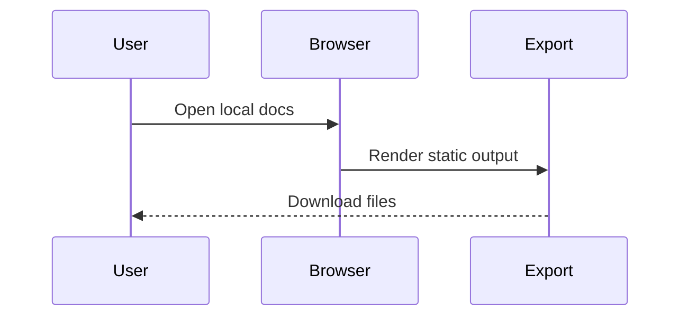

# Larger Fixture

This document is intentionally modest but longer than a tiny smoke sample.

## Section One

Markdown keeps documentation readable, portable, and easy to review.

## Section Two

```python
def render_status(diagrams):
    return f"{diagrams} diagrams rendered"
```

## Section Three



## Section Four

- Local-first editing
- Static hosting
- Repeatable exports

