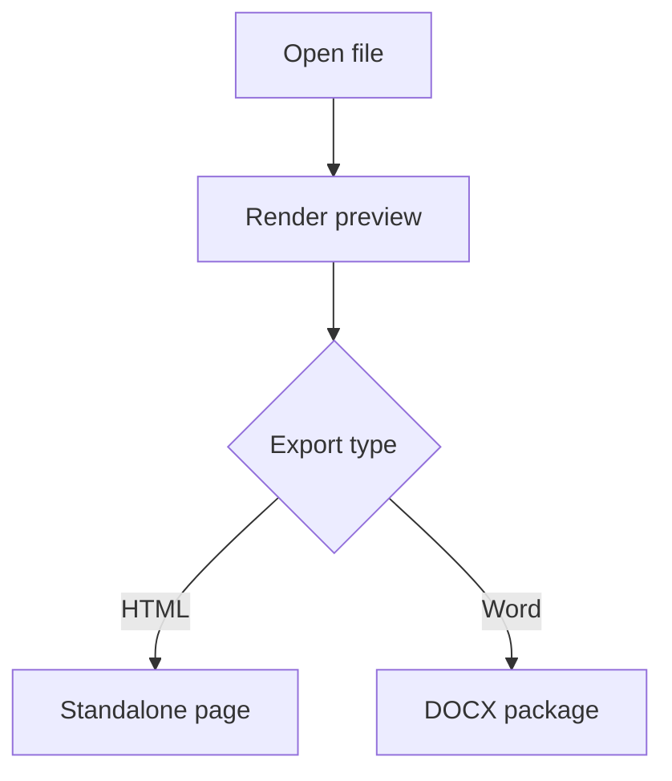

# Export Fixture

This document exercises Markdown, Mermaid, and syntax highlighting.



```js
const message = 'release ready';
function announce(value) {
  return value.toUpperCase();
}
```

| Area | Status |
|---|---|
| Preview | Ready |
| Export | Verified |

## Checklist

1. Render the diagram.
2. Keep code copy controls in HTML.
3. Remove interactive controls from Word.
