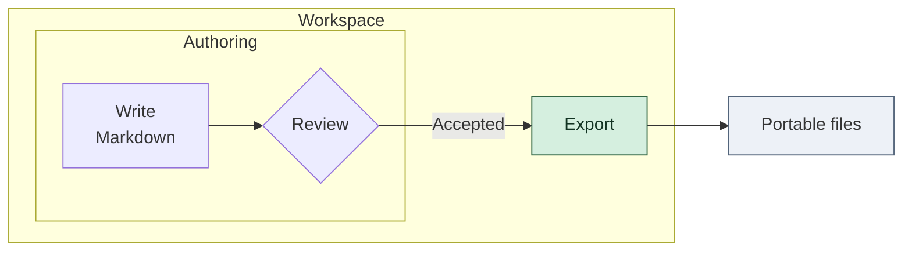
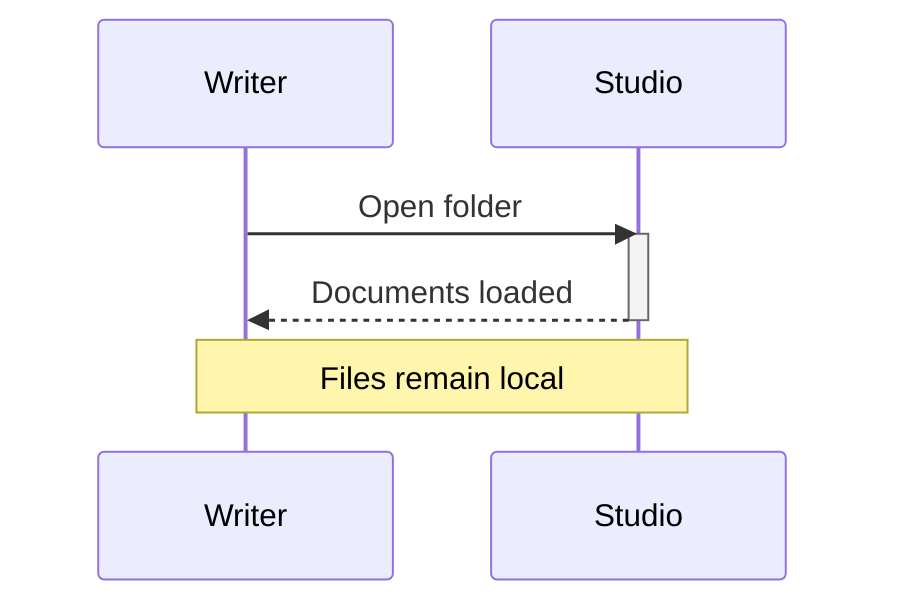
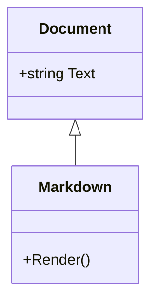
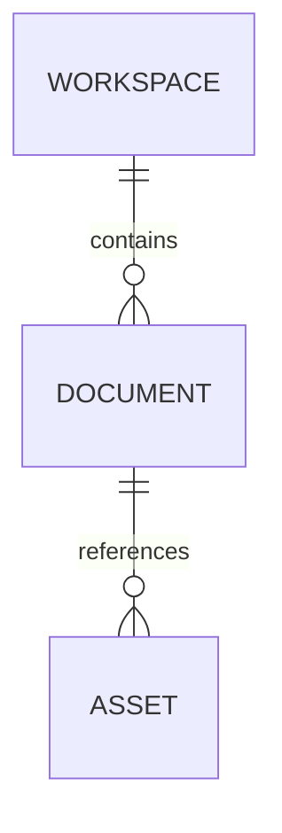
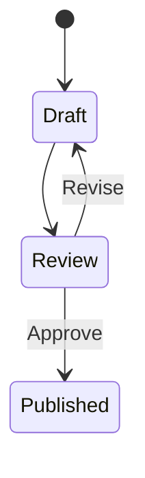
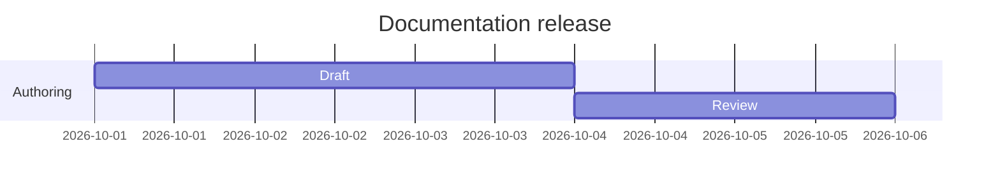
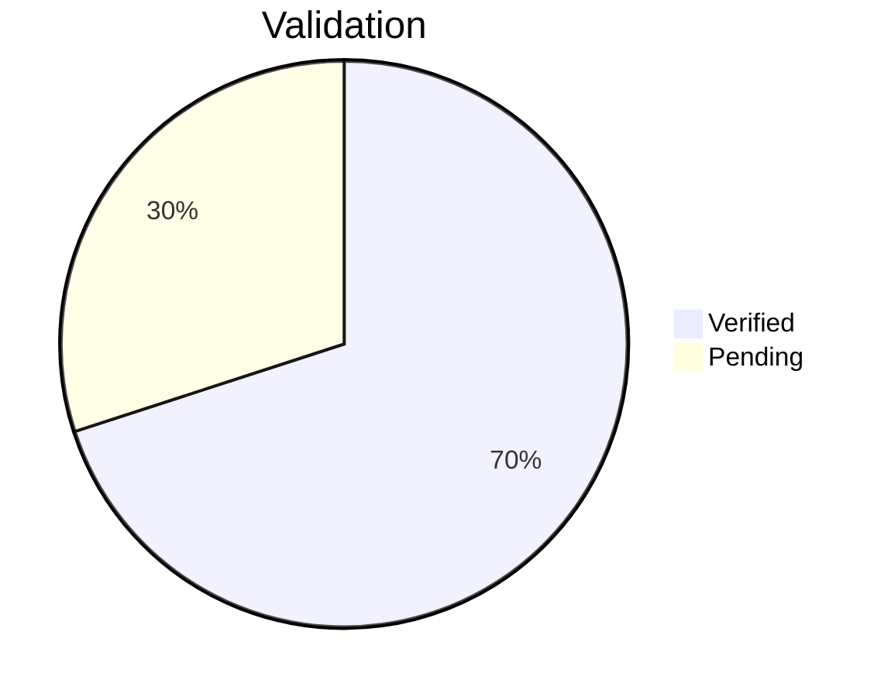
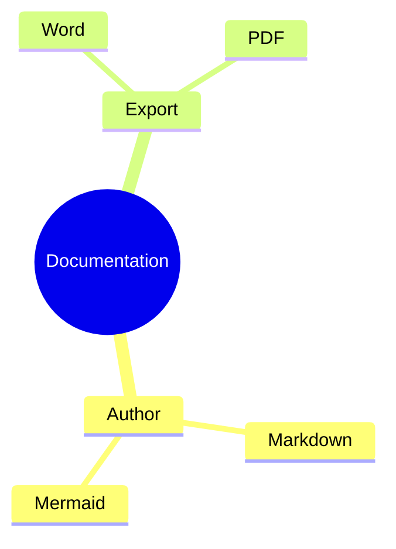

# Native Mermaid compatibility corpus

## Nested subgraphs and labels

```mermaid
flowchart LR
  subgraph Workspace
    subgraph Authoring
      A["Write<br/>Markdown"] --> B{Review}
    end
    B -->|Accepted| C[Export]
  end
  C --> D[Portable files]
  classDef ready fill:#d5efdf,stroke:#336644,color:#123322
  class C ready
  style D fill:#edf1f7,stroke:#52647a
```

## Sequence

```mermaid
sequenceDiagram
  participant Writer
  participant Studio
  Writer->>Studio: Open folder
  activate Studio
  Studio-->>Writer: Documents loaded
  deactivate Studio
  Note over Writer,Studio: Files remain local
```

## Types and relationships

```mermaid
classDiagram
  Document <|-- Markdown
  Document : +string Text
  Markdown : +Render()
```

```mermaid
erDiagram
  WORKSPACE ||--o{ DOCUMENT : contains
  DOCUMENT ||--o{ ASSET : references
```

```mermaid
stateDiagram-v2
  [*] --> Draft
  Draft --> Review
  Review --> Draft : Revise
  Review --> Published : Approve
```

## Planning and proportions

```mermaid
gantt
  title Documentation release
  dateFormat YYYY-MM-DD
  section Authoring
  Draft :a1, 2026-10-01, 3d
  Review :after a1, 2d
```

```mermaid
pie title Validation
  "Verified" : 70
  "Pending" : 30
```

```mermaid
mindmap
  root((Documentation))
    Author
      Markdown
      Mermaid
    Export
      Word
      PDF
```
