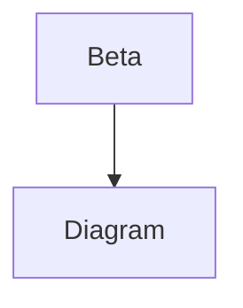

# Scroll Sync Fixture

Intro line 1
Intro line 2
Intro line 3
Intro line 4
Intro line 5
Intro line 6
Intro line 7
Intro line 8

## Alpha Section

Alpha line 1
Alpha line 2
Alpha line 3
Alpha line 4
Alpha line 5
Alpha line 6
Alpha line 7
Alpha line 8
Alpha line 9
Alpha line 10

```js
const alpha = 'anchor';
console.log(alpha);
```

Alpha line 11
Alpha line 12
Alpha line 13
Alpha line 14
Alpha line 15
Alpha line 16
Alpha line 17
Alpha line 18
Alpha line 19
Alpha line 20

## Beta Section

Beta line 1
Beta line 2
Beta line 3
Beta line 4
Beta line 5
Beta line 6
Beta line 7
Beta line 8
Beta line 9
Beta line 10



Beta line 11
Beta line 12
Beta line 13
Beta line 14
Beta line 15
Beta line 16
Beta line 17
Beta line 18
Beta line 19
Beta line 20

## Gamma Section

Gamma line 1
Gamma line 2
Gamma line 3
Gamma line 4
Gamma line 5
Gamma line 6
Gamma line 7
Gamma line 8
Gamma line 9
Gamma line 10
Gamma line 11
Gamma line 12
Gamma line 13
Gamma line 14
Gamma line 15
Gamma line 16
Gamma line 17
Gamma line 18
Gamma line 19
Gamma line 20

